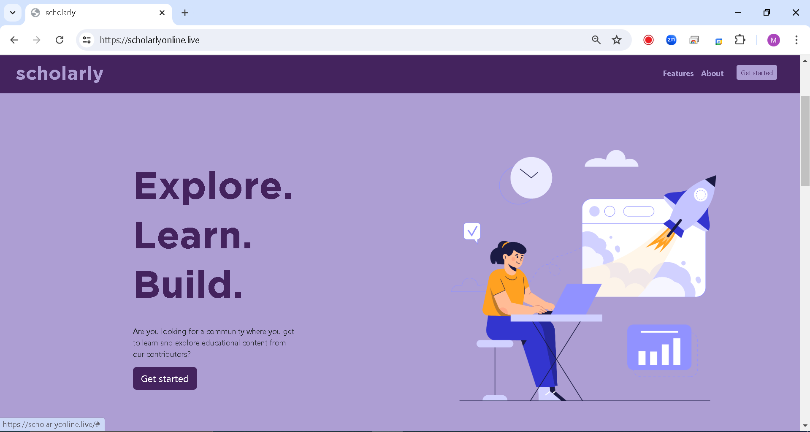

# Contributing to [Project Name]

Welcome to [Project Name]! We appreciate your interest in contributing. This document outlines the guidelines and steps to contribute to our project.

## Table of Contents
- [Getting Started](#getting-started)
- [Contributing Guidelines](#contributing-guidelines)
- [Code Style](#code-style)
- [Submitting a Pull Request](#submitting-a-pull-request)
- [License](#license)

## Getting Started
To get started with contributing to [Project Name], follow these steps:


1. Clone the repository

    ```bash
    git clone https://{$YOUR_GIT_TOKEN}@github.com/mojalefakodisang/scholarly
    ```
2. Install a virtual environment
    
    ```bash
    sudo apt-get install -y virtualenv
    ```

3. Create a virtual environment

    ```bash
    cd scholarly # Change directory to scholarly
    virtualenv venv
    ```

4. Activate the virtual environment
    
    ```bash
    source venv/bin/activate
    ```

5. Install the dependencies

    ```bash
    pip install -r requirements.txt
    ```

6. Set the following environment variables

    ```bash
    export SCHOLARLY_EMAIL=email_you_want_to_use_for_development
    export EMAIL_PASSWORD=app_password # not email password
    export SECRET_KEY=your_secret_key # create a secret key
    export DB_ENGINE='django.db.backends.mysql'
    export DB_USER=your_db_username
    export DB_PASSWORD=your_user_db_password
    export DB_NAME=scholarly
    export DB_HOST=localhost
    export DB_PORT=3306
    ```

7. Create the database and user in MySQL 8.0
    
    ```sql
    CREATE DATABASE scholarly;
    CREATE USER 'your_db_username'@'localhost'IDENTIFIED BY 'your_user_db_password';
    GRANT ALL PRIVILEGES ON scholarly.* TO'your_db_username'@'localhost';
    FLUSH PRIVILEGES;
    ```

8. Run the migrations

    ```bash
    python3 -m manage makemigrations
    python3 -m manage migrate
    ```

9. Create a superuser

    ```bash
    python3 -m manage createsuperuser
    ```

10. You are all set. You now going to run the server

    ```bash
    python3 -m manage runserver
    ```

    Outcome:

    ```markdown
    Watching for file changes with StatReloader
    Performing system checks...

    System check identified no issues (0 silenced).
    August 25, 2024 - 12:00:00
    Django version 3.2.7, using settings 'scholarly.settings'
    Starting development server at http://127.0.0.1:8000/
    Quit the server with CONTROL-C.
    ```

11. Open your browser and navigate to `http://localhost:8000/` to view the application

    

12. You can now [log in](http://localhost:8000/login/) with the superuser credentials you created in step 9 or create a new one


## Contributing Guidelines
Please follow these guidelines when contributing to Scholarly:

- Before starting work on a new feature or bug fix, create an issue on GitHub to discuss the proposed changes.
- Ensure that your code adheres to the project's code style guidelines (see [Code Style](#code-style)).
- Write clear and concise commit messages.
- Test your changes thoroughly before submitting a pull request.

## Code Style
Scholarly follows a specific code style to maintain consistency throughout the codebase. Please refer to the [pycodestyle](https://pycodestyle.pycqa.org/en/latest/) documentation for detailed instructions on how to format your code.

## Submitting a Pull Request
To submit your changes for review, follow these steps:

1. Commit your changes with a descriptive commit message.
2. Push your changes to your forked repository.
3. Open a pull request on the main repository.
4. Provide a clear and detailed description of your changes in the pull request.

## License
By contributing to [Project Name], you agree that your contributions will be licensed under the [project's license](LICENSE).

Thank you for your interest in contributing to Scholarly! We appreciate your time and effort.
